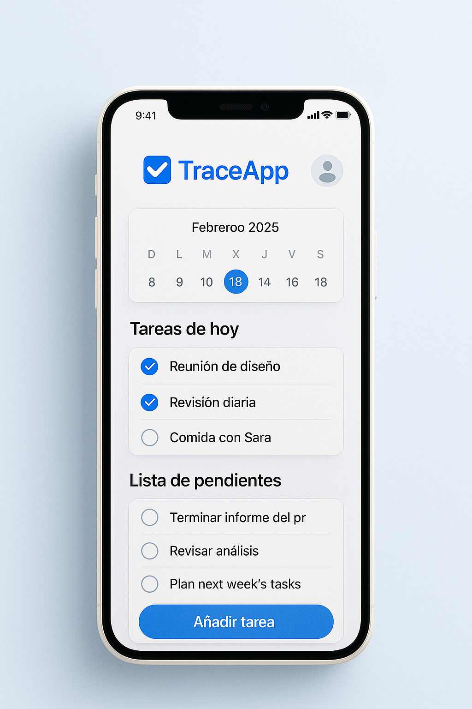

# Landing Page - TraceApp

Diseño de una landing page responsiva basada en el sitio TraceApp.

## ✅ Descripción
- HTML5 semántico
- CSS modular (BEM, variables)
- Grid + Flexbox
- Totalmente responsive
- Animaciones en botones
- Publicado en GitHub Pages

## 🚀 Vista previa

 

# 🚀 Link del sitio:

https://melaniaraceli.github.io/traceapp-landing/ 
